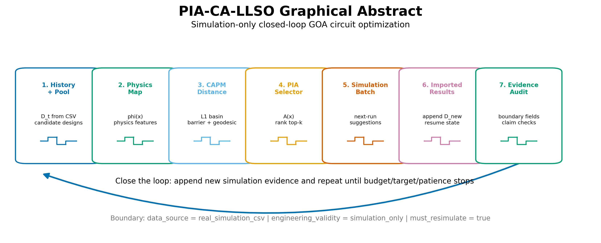
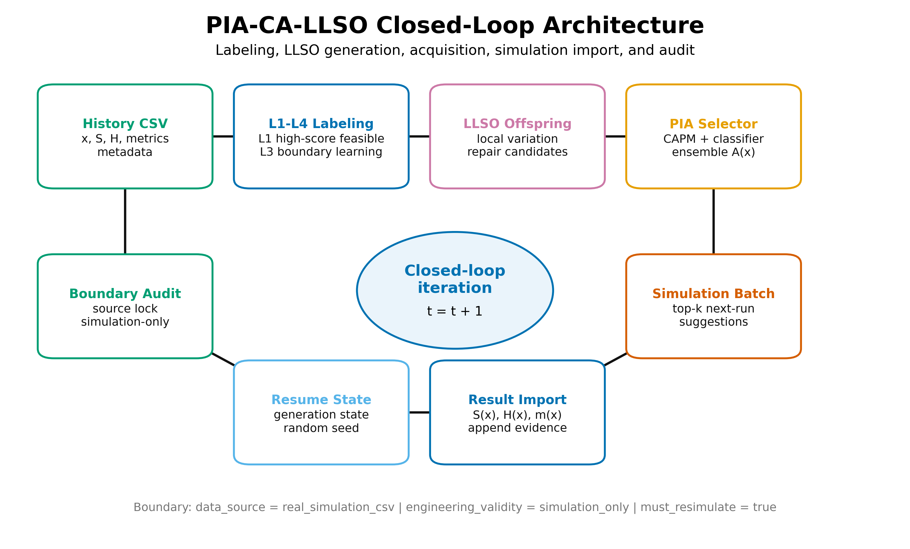
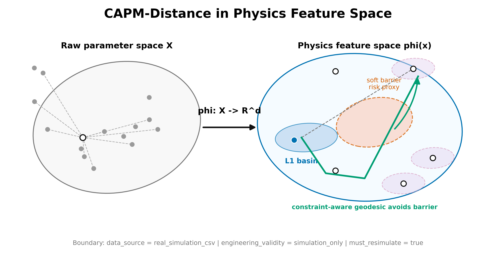
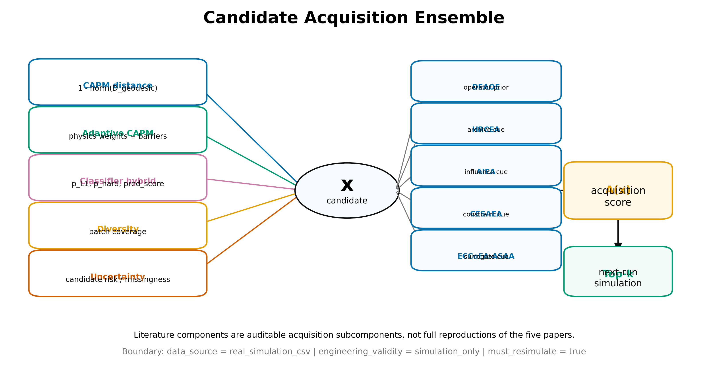
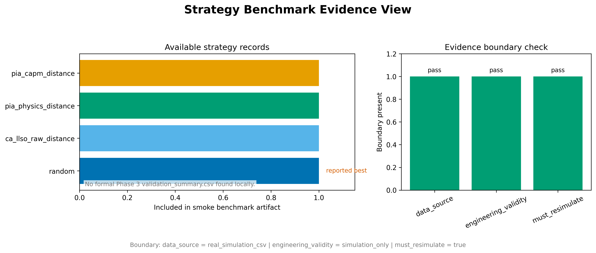
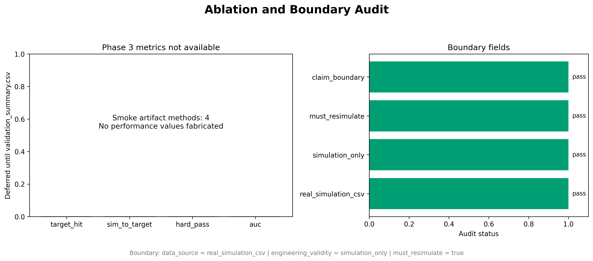
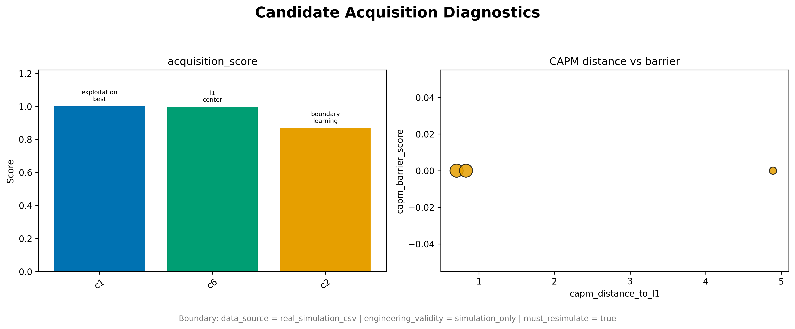

# 一种面向 GOA 显示驱动电路昂贵仿真的物理感知闭环候选选择方法

作者：待补充

## 摘要

GOA 显示驱动电路的参数优化通常依赖昂贵的瞬态仿真，而小样本历史、硬约束失效和候选空间物理语义不均衡会使纯参数距离或黑盒预测排序难以稳定使用有限仿真预算。本文提出一种 Physics-Informed Adaptive CA-LLSO（PIA-CA-LLSO）候选选择框架，将 GOA 设计变量映射到电路物理语义特征空间，并在该空间内构造 Constraint-Aware Physics-Manifold Distance（CAPM-Distance），以 L1 高质量可行样本 basin、软约束 barrier、物理耦合项、缺失特征惩罚和图上测地距离共同决定下一轮仿真候选优先级。该框架进一步将层级分类器、CAPM 距离、自适应物理先验、多样性、LLSO offspring、仿真批次生成、结果导入、断点恢复和边界审计组织为可审计的闭环工作流。基于当前仓库已有证据，Phase 3 smoke 协议覆盖 1 个 sample_goa 场景、6 类方法、7 类消融、2 个 seed 和 budget=8，所有方法在该轻量样例上均达到 target_hit_rate=1.0、best_score_mean=92.0，pairwise win rate 未能区分方法优劣；paper-baseline reproduction 侧面实验中，classifier_level_hybrid 与 paper_ca_llso 均以 simulations_to_target=1 达到目标，两个 paper-inspired baseline 的 target_hit_rate 为 0.75 且 simulations_to_target 为 2。上述结果支持 PIA-CA-LLSO 作为 simulation-only、next-run simulation suggestions 的可复现闭环候选选择框架，但尚不足以声称其在完整多场景 benchmark 中显著优于所有 baseline。全文证据边界固定为 `data_source = real_simulation_csv`、`engineering_validity = simulation_only`、`must_resimulate = true`；本文不主张物理实测、硅验证、流片验证或无需重仿真的真实电路改进。

方法层面新增的 `active_uncertainty_diversity` 将随机森林树间方差、分类熵不确定性和批内 greedy diversity 纳入候选采集函数，用于 low-data active acquisition。该策略已作为下一轮正式验证协议中的候选方法接入，但旧版 smoke 数值表尚不包含它，因此本文只将其写作待真实仿真验证的主动采样扩展。

**关键词**：GOA 显示驱动电路；昂贵仿真；候选选择；物理语义距离；CAPM-Distance；CA-LLSO；simulation-only evidence

## I. 引言

主动矩阵显示系统中的 gate driver on array（GOA）或 scan-driver 电路需要在有限面积、器件阈值漂移、RC 负载、bootstrap 能力和时序重叠约束之间取得平衡。近年来，基于 metal-oxide TFT 或 IGZO TFT 的移位寄存器和大尺寸 AMOLED GOA 结构持续被用于提升窄边框、高分辨率和大面板显示驱动能力 [4]-[6]。这些电路的性能验证通常依赖 SPICE 类瞬态仿真或论文波形提取，而一次候选参数评估可能涉及多输出波形、保持电平、纹波、延迟、低频稳定性和硬约束通过情况。对于学生竞赛、早期原型和工程自动化系统而言，最直接的困难不是缺少单次评分函数，而是在预算有限时决定下一轮应该仿真哪些候选。

传统候选选择可以直接在原始参数空间中使用欧氏距离、随机采样、手工规则或 surrogate 预测分数排序。此类方法实现简单，但容易忽略电路参数之间的物理单位、尺度差异和耦合关系。例如，TFT 的上拉/下拉宽长比、bootstrap 电容与负载电容比例、门压裕量和 RC 压力 proxy 不是同一种坐标维度，直接比较原始数值可能把物理含义完全不同的变化视为等价变化。另一方面，纯黑盒 surrogate 在小样本历史下容易过拟合；即使分类器预测某个候选接近高质量区域，也不能保证该候选具备足够门压裕量、驱动平衡或可接受的负载压力。CA-LLSO 类方法利用 level-based learning 和高质量样本邻域思想，为小样本优化提供了自然框架，但其 raw distance 版本仍需要被扩展到更接近电路机理的物理语义空间。

本文的核心问题是：在只能使用当前已导入仿真 CSV 证据、且所有新候选仍必须重新仿真的条件下，如何构建一个既能利用 L1 高质量样本经验、又能显式考虑 GOA 物理约束风险的下一轮候选选择框架。为回答这一问题，本文提出 PIA-CA-LLSO。该方法将候选设计 \(x\) 映射为物理语义特征 \(\phi(x)\)，在该特征空间内定义 CAPM-Distance，并将候选排序从“参数数值接近”推进到“接近高质量可行区域、避开高风险物理边界、保持候选多样性”的综合 acquisition 过程。Fig. 1 给出了本文方法的图形摘要，Fig. 2 展示了从历史仿真、标签生成、offspring 生成、PIA selector、simulation batch、结果导入到 boundary audit 的闭环结构。

本文贡献体现在四个方面。首先，本文提出 CAPM-Distance，将 GOA 参数映射到由驱动比例、bootstrap/负载裕量、门压裕量、时钟边沿和 RC 压力构成的物理语义空间，并用张量距离、软约束 barrier、missing penalty 和图上 geodesic 描述候选到 L1 basin 的接近度。其次，本文构建 PIA-CA-LLSO 候选 acquisition 框架，将 L1-basin proximity、物理约束风险、层级分类器、多样性和不确定性统一到 next-run simulation suggestions 的排序中。第三，本文将单步候选排序扩展为可恢复闭环流程，连接 LLSO offspring、候选修复、仿真批次、结果导入和停止条件。第四，本文将 `real_simulation_csv / simulation_only / must_resimulate` 作为机器可读和论文可读的证据边界，在结果表、图注、验证报告和审计清单中阻止把候选建议误写为物理验证结论。

## II. 相关工作

GOA 与 scan-driver 电路研究为本文提供了具体应用场景。You 等提出适用于 depletion-mode metal-oxide TFT 的 10T-2C scan driver 电路，为 GOA/scan-driver 拓扑、参数表和波形弱标签提供了主要参考 [4]。Song 等研究了用于 31-inch 4K AMOLED 显示的 dual-gated TFT 高速移位寄存器，为 Q-node 行为和多级传播理解提供了辅助证据 [5]。Zhou 等报道了 31-inch AMOLED 显示中集成 metal oxide TFT gate driver 的设计，为大尺寸面板、输入信号、阈值漂移、RC 负载和测量波形弱标签提供了参考 [6]。这些文献强调了 GOA 电路优化不仅关心单一延迟或电压指标，还受到多级传播稳定性、器件裕量和输出波形约束共同影响。

在优化算法层面，LLSO 与 CA-LLSO 的思想为候选从不同质量层级向高质量样本学习提供了结构化路径。将历史样本划分为 L1/L2/L3/L4 后，高质量可行样本可作为 teacher，中等或边界样本可作为 learner，而低质量或失败样本仍可用于识别约束边界。该思想适合昂贵仿真场景，因为它不要求大规模训练集即可表达“向高质量可行区域靠近”的搜索偏好。然而，如果候选接近性只由原始参数空间距离定义，搜索仍可能偏向数值上相近但物理上风险较高的区域。因此，本文将 level-based learning 的邻域概念保留为 L1 basin，但把距离度量改写为约束感知物理流形距离。

IEEE 作者中心建议工程论文应具有明确题名、摘要、关键词、引言、方法、结果、讨论、结论和参考文献结构，并在结果部分使用图表表达趋势和精确数值 [1], [2]。IEEE 图形指南同时要求图形格式、字体、线宽和灰度可解释性适合出版处理 [3]。因此，本文将已有 Fig. 1 至 Fig. 7 作为论文图表骨架，同时在所有图注和表格中标注证据角色。需要强调的是，本文引用的 paper-baseline reproduction 并不是对原论文表格的逐项复现，而是在当前 GOA/PIA simulation-only 协议下构造的一组可比较 baseline；其证据角色是统一协议侧面实验，而不是原始论文 benchmark 复现。

## III. 问题定义与证据边界

设 GOA 显示驱动电路的设计变量为 \(x \in X\)，其中 \(X\) 由配置文件中的 parameter columns 定义，可以包含宽长比、电容、时钟和电压相关参数。一次仿真导入被视为黑盒评估 \(F(x)=(m(x),S(x),H(x))\)，其中 \(m(x)\) 是波形和评分指标集合，\(S(x)\) 对应代码字段 `overall_score`，表示单次仿真评分，\(H(x)\) 对应 `hard_constraint_passed`，表示硬约束是否全部通过。第 \(t\) 轮闭环的历史仿真集记为 \(D_t\)，候选池记为 \(C_t\)，预算记为 \(B\)，目标阈值记为 \(T\)。

本文区分四个容易混淆的目标层级。`overall_score` 是单次仿真评分层，用于描述某个候选在已导入仿真结果中的综合表现；`objective_score` 是 profile 加权目标层，可用于解释特定工程 profile 下的加权目标，但不是 PIA selector 的唯一排序依据；`acquisition_score` 是候选采集层，只表示下一轮仿真的优先级；`simulations_to_target` 是验证实验主结果层，表示达到目标分数和可行条件所需的导入仿真次数。该区分避免把仿真前排序 proxy 误写成仿真后性能结论。

本文的证据边界是方法设计和结果解释的核心约束。所有使用的验证文件、报告、图表和论文结论均保持 `data_source = real_simulation_csv`、`engineering_validity = simulation_only`、`must_resimulate = true`。这意味着候选输出是 next-run simulation suggestions，而不是芯片、样品、实验台或流片后的验证结论。即使某些输入文件来自真实仿真 CSV 或本地 simulator adapter，本文仍只把它们解释为 simulation-only evidence；paper-derived 弱标签或 local fixture 行为也不能被写成真实仿真复现。

## IV. 方法

PIA-CA-LLSO 的第一步是把原始候选参数 \(x\) 映射为物理语义特征 \(\phi(x)\)。在 GOA profile 中，代表性特征包括 `pullup_w_l`、`pulldown_w_l`、`pullup_pulldown_ratio`、`cboot_cload_ratio`、`ron_pullup_cload_proxy`、`ron_pulldown_cload_proxy`、`clk_slew_proxy`、`vgh_vth_margin`、`vgl_off_margin` 和 `holding_droop_proxy`。这些特征来自设计参数派生，而不能包含 `overall_score`、`objective_score`、`hard_constraint_passed`、waveform metrics 或其他 imported-result columns。该约束保证 CAPM-Distance 是仿真前候选排序方法，不把真实仿真结果泄漏到候选距离中。

CAPM-Distance 的核心形式为

```text
D_capm(x, y) =
  D_tensor(x, y)
+ lambda_barrier * D_barrier(x, y)
+ lambda_graph * D_geodesic(x, y)
+ lambda_missing * D_missing(x, y)
```

其中 \(D_tensor\) 在物理语义特征上计算各向异性距离，并可加入少量耦合项，例如 `Ron*Cload` 与 `clk_slew_proxy` 的组合风险、`cboot_cload_ratio` 与 `vgh_vth_margin` 的裕量组合。\(D_barrier\) 是仿真前软约束风险 proxy，用于提高低门压裕量、过低 bootstrap/load ratio、过高 RC 压力或上下拉失衡候选的排序代价。\(D_missing\) 防止缺失关键物理输入被错误解释为零距离。\(D_geodesic\) 在 candidate 和 history 构成的小型 kNN 图上计算候选到任意 L1 样本的最短路径，使“接近 L1 basin”不再只等同于直线距离接近。Fig. 3 展示了 CAPM-Distance 在物理语义空间中的概念结构。

历史样本根据 `overall_score` 和 `hard_constraint_passed` 被划分为 L1/L2/L3/L4。L1 表示高分且硬约束通过的样本，是候选希望接近的高质量可行区域；L2 表示中等分数但可行的样本，可作为 learner 或可行边界参考；L3 表示低分可行或硬约束失败样本，可帮助识别风险边界；L4 表示仿真失败、不可评估或 predicted-only 样本，不能进入外部 benchmark 的真实证据集合。PIA-CA-LLSO 使用 L1 teacher 与 L2/L3 learner 生成 LLSO offspring，然后将 offspring、修复候选和候选池合并进入 selector。

候选采集函数 \(A(x)\) 将 CAPM 距离、硬风险门控、多样性和模型诊断统一为下一轮仿真优先级。`pia_capm_distance` 不依赖大规模训练集，而是按 `capm_hard_risk_passed`、归一化到 L1 的 CAPM 距离、多样性和候选 ID 稳定排序。`adaptive_pia_capm` 在保留物理先验的基础上，根据历史仿真结果调整特征权重和 acquisition 权重。`classifier_level_hybrid` 则将 \(p_{L1}(x)\)、\(p_{hard}(x)\)、predicted score、CAPM proximity、hard risk mask 和 diversity 组合为混合 acquisition score。`active_uncertainty_diversity` 进一步将 `classifier_level_hybrid` 作为 base score，并引入 `level_entropy_uncertainty`、`hard_pass_entropy_uncertainty`、`score_tree_std_uncertainty` 和 `batch_diversity_score`，用 greedy max-min 方式形成低数据主动采样批次。`active_influence_on_demand` 在此基础上加入 CAPM 邻域 influence gain、on-demand constraint urgency 和 transfer trust，用于更细粒度的 simulation-only 预算调度。Fig. 4 展示了 CAPM 距离、自适应物理先验、分类器概率、多样性、不确定性和 paper-inspired acquisition 子分量之间的关系。

闭环流程由 `pia-evolve` 连接。每一代从历史 CSV 和候选 CSV 出发，完成标签生成、offspring 生成、候选选择、simulation batch 输出，然后根据运行模式进入 offline wait、import_results 或 external_command。导入结果追加回历史后，系统更新 generation state、run manifest、evolution summary 和 boundary audit，并根据 target score、budget、patience 或最小改进规则停止。该设计的贡献不在于替代仿真器，而在于把仿真前候选推荐、仿真后证据导入和审计边界组织成可恢复、可复现、可追踪的 simulation-only 优化循环。

## V. 实验设置

本文使用当前仓库已有证据，不额外运行多场景正式验证。第一组证据来自 `outputs/pia_phase3_smoke/experimental_validation_report.md`、`validation_summary.csv` 和 `pairwise_win_rates.csv`。该 smoke 协议的目标是确认 Phase 3 validation runner、统计聚合、消融展开和 boundary audit 能够在轻量条件下运行，而不是最终证明方法显著优越。旧版 smoke 输出的 primary outcome 为 `simulations_to_target`，target_score 为 80，场景为 sample_goa，方法包括 random、ca_llso_raw_distance、pia_capm_distance、adaptive_pia_capm、classifier_level_hybrid 和 pia_evolve_full，消融包括 full、no_classifier、no_adaptive_capm、no_constraint_repair、no_llso_offspring、no_evaluation_scheduler 和 capm_only，budget 为 8，每个组合有 2 个 seed。当前验证协议已新增 `active_uncertainty_diversity` 和 `active_influence_on_demand`，但在重新运行正式 smoke/full validation 前，旧表格不能被追溯改写为包含这些策略的结果。

第二组证据来自 `outputs/pia_phase3_smoke/paper_reproduction_report.md` 和 `paper_baseline_summary.csv`。该实验使用统一 GOA/PIA simulation-only 协议比较 classifier_level_hybrid、paper_ca_llso、paper_adaptive_constraint_eval 和 paper_distributed_multi_constraint。报告明确标注 `fidelity_level = faithful_goa_reimplementation` 与 `claim_boundary = not_original_paper_benchmark_reproduction`，因此其作用是提供 paper-inspired baseline 的侧面比较，而不是复现原始论文 benchmark 表格。

本文所有图表均来自当前仓库已有文件。Fig. 1 至 Fig. 7 来自 `docs/pia_ca_llso_paper_figures/figures/`，包括图形摘要、闭环架构、CAPM 物理流形、候选采集集成层、策略基准证据视图、消融与边界审计以及候选采集诊断。Fig. 5 和 Fig. 6 只能作为 sample/smoke visualization 或 boundary audit visualization，不能被解释为完整 Phase 3 validation 的最终数值证据。



Fig. 1. PIA-CA-LLSO 图形摘要。该图概述从历史仿真 CSV 与候选设计出发，经物理语义特征映射、CAPM-Distance、PIA 采集选择、下一轮仿真批次和结果导入形成闭环的流程。图中所有结果边界限定为 `data_source = real_simulation_csv`、`engineering_validity = simulation_only`、`must_resimulate = true`。



Fig. 2. PIA-CA-LLSO 闭环架构。该图展示 L1/L2/L3/L4 标签、LLSO offspring、候选修复、PIA selector、仿真批次、结果导入、resume state 与 boundary audit 的模块关系。



Fig. 3. CAPM-Distance 物理语义流形示意。原始设计变量通过 \(\phi(x)\) 映射到物理特征空间，候选点到 L1 basin 的距离由 tensor/coupling 距离、soft barrier、missing penalty 和图上 geodesic 共同刻画。barrier 仅是仿真前风险 proxy，不等同于真实硬约束失败。



Fig. 4. 候选采集集成层。CAPM 距离、自适应物理权重、分类器概率、多样性、不确定性和 paper-inspired 子分量共同形成 \(A(x)\)，用于排序下一轮仿真建议；该层不是对外部论文算法的完整复现。

## VI. 结果

Table I 总结了本文方法的主要组件与创新角色。PIA-CA-LLSO 的重点不是单独引入一个距离公式，而是把物理语义距离、L1 basin、分类器证据、候选多样性和仿真边界审计连接为一个完整的昂贵仿真候选选择系统。CAPM-Distance 在该系统中承担仿真前物理 proxy 的角色，因此它可以改变候选进入下一轮仿真的优先级，但不能单独证明候选真实通过硬约束。

Table I. 方法组件与创新角色

| 组件 | 作用 | 当前证据角色 |
|---|---|---|
| 物理语义特征 \(\phi(x)\) | 将原始参数映射到 GOA 电路物理 proxy | 方法定义与候选诊断 |
| CAPM-Distance | 刻画候选到 L1 basin 的约束感知物理距离 | 仿真前排序 proxy |
| classifier_level_hybrid | 融合 L1 概率、hard-pass 概率、CAPM proximity 和多样性 | 当前侧面实验中表现最好之一 |
| active_uncertainty_diversity | 融合 base score、森林/分类熵不确定性和 greedy batch diversity | 新增主动采样策略，需后续真实仿真验证 |
| active_influence_on_demand | 融合 influence gain、on-demand constraint urgency 和 transfer trust | simulation-only active acquisition，需后续真实仿真验证 |
| `pia-evolve` 闭环 | 生成、选择、仿真导入、恢复和审计 | smoke 证据证明链路可运行 |
| boundary audit | 保持 simulation-only 证据边界 | 全部当前表格均通过边界字段检查 |

Table II 给出当前论文使用的实验协议和证据边界。Phase 3 smoke 的 run_count 为 84，这来自 1 个场景、6 个方法、7 个消融、2 个 seed 和单一 budget=8 的组合。该设计适合验证 runner、报告和审计链路，但它太轻量，不能支撑完整 IEEE 投稿中的强统计结论。paper-baseline reproduction 侧面实验的方法数较少，但结果区分度更高，因此更适合在本文中作为初步比较结果展示。

Table II. 实验协议与证据边界

| 协议 | 场景 | 方法 | 消融 | seed | budget | target_score | 证据边界 |
|---|---:|---:|---:|---:|---:|---:|---|
| Phase 3 smoke | 1 | 6 | 7 | 2 | 8 | 80 | `real_simulation_csv / simulation_only / must_resimulate` |
| Paper-baseline reproduction | 1 | 4 | 不适用 | 当前报告聚合 | 当前报告聚合 | 80 | `real_simulation_csv / simulation_only / must_resimulate` |

Table III 展示 Phase 3 smoke 的主要结果。在 sample_goa 的轻量协议下，adaptive_pia_capm、ca_llso_raw_distance、classifier_level_hybrid、pia_capm_distance、pia_evolve_full 和 random 的所有消融组合均显示 target_hit_rate=1.0、best_score_mean=92.0、best_score_std=0.0、boundary_audit_pass_rate=1.0。pairwise win rates 文件进一步显示，各方法相对于 random 的 win_rate_vs_random 均为 0.0，comparison_count 为 2。这一结果说明当前 smoke 数据集和预算设置不足以区分方法优劣；它能支持流程可运行和边界字段可追踪，却不能支持 PIA-CA-LLSO 在该实验上显著优于 random 的结论。Fig. 5 和 Fig. 6 因此应被解释为可审计证据视图，而不是最终 superiority figure。



Fig. 5. 策略基准证据视图。该图展示当前可用的 benchmark artifact、方法字段和边界字段；在完整 Phase 3 validation CSV 缺失时，它不支持最终方法优越性结论。



Fig. 6. 消融与边界审计。该图汇总当前可用验证指标和 `real_simulation_csv / simulation_only / must_resimulate` 边界字段；正式数值消融结论仍需多场景 Phase 3 full validation。

Table III. 当前 Phase 3 smoke 结果摘要

| 方法集合 | run_count | target_hit_rate | best_score_mean | best_score_std | win_rate_vs_random | boundary_audit_pass_rate |
|---|---:|---:|---:|---:|---:|---:|
| 全部 6 方法 × 7 消融组合 | 84 | 1.0 | 92.0 | 0.0 | 0.0 | 1.0 |

Table IV 展示 paper-baseline reproduction 的当前结果。classifier_level_hybrid 与 paper_ca_llso 均选择 4 个候选，target_hit_rate 为 1.0，simulations_to_target 为 1，best_evidence_score 为 94.0；classifier_level_hybrid 的 convergence_auc 为 282.0，paper_ca_llso 为 280.5。paper_adaptive_constraint_eval 与 paper_distributed_multi_constraint 的 target_hit_rate 均为 0.75，simulations_to_target 为 2，best_evidence_score 为 91.0，convergence_auc 为 220.5。该结果说明，在当前统一 GOA/PIA simulation-only 协议下，classifier_level_hybrid 至少不弱于 paper_ca_llso，并优于两个 paper-inspired baseline；但由于报告已明确其不是原论文 benchmark 复现，本文只将其解释为侧面协议证据。

Table IV. Paper-baseline reproduction 结果

| 方法 | selected_count | target_hit_rate | simulations_to_target | convergence_auc | best_evidence_score | mean_acquisition_score |
|---|---:|---:|---:|---:|---:|---:|
| classifier_level_hybrid | 4 | 1.0 | 1 | 282.0 | 94.0 | 0.7723 |
| paper_ca_llso | 4 | 1.0 | 1 | 280.5 | 94.0 | 0.5924 |
| paper_adaptive_constraint_eval | 4 | 0.75 | 2 | 220.5 | 91.0 | 0.6935 |
| paper_distributed_multi_constraint | 4 | 0.75 | 2 | 220.5 | 91.0 | 0.3935 |

Fig. 7 展示了候选采集诊断。该图的价值在于解释某些候选为何被选为 next-run simulation suggestions，例如 acquisition score、CAPM 距离、barrier 和候选角色如何共同影响排序。由于这些候选仍需要后续仿真确认，Fig. 7 不应被解释为物理性能已经提升的证据。



Fig. 7. 候选采集诊断。该图基于 `pia_selected_candidates.csv` 或样例候选池展示 `acquisition_score`、CAPM 距离、barrier 和候选角色，用于解释下一轮仿真建议，不代表最终真实性能证据。

## VII. 讨论

当前结果最重要的意义在于证明 PIA-CA-LLSO 的方法定义、工程接口、图表证据和边界审计已经形成一条一致链路。与直接在原始参数空间计算距离相比，CAPM-Distance 使候选接近度具备 GOA 电路物理解释；与纯 surrogate 排序相比，CAPM barrier 和 missing penalty 把不可忽略的工程风险前置到仿真前排序中；与单步候选选择相比，`pia-evolve` 将选择、仿真导入和状态恢复组织为闭环。这些机制对于昂贵仿真场景是必要的，因为真实决策并不是一次性预测某个候选最好，而是在有限预算下持续决定下一批最值得重仿真的候选。

同时，本文当前证据并不支持过强结论。Phase 3 smoke 结果在 sample_goa 中没有区分随机策略和 PIA 系列方法，原因可能是样例候选池过小、目标阈值较易达到、budget=8 过低或导入结果本身已经使所有方法快速触达目标。该结果不能被包装为“PIA-CA-LLSO 显著优于 random”，只能说明验证 runner、消融展开、报告输出和边界审计能够运行。paper-baseline reproduction 提供了更有区分度的数字，但它仍是统一协议下的 faithful GOA reimplementation，而不是外部论文原 benchmark 的逐表复现。因此，本文对当前结果采用保守写法：PIA-CA-LLSO 已具备可审计闭环候选选择框架和初步侧面证据，但投稿前仍需正式多场景、多预算、多 seed 的 full validation。

未来工作应优先补齐五类实验。第一，应使用至少 3 个真实 case pack 或固定场景，运行 budgets=20、50、100 的多预算验证。第二，应在 random、ca_llso_raw_distance、pia_physics_distance、pia_capm_distance、adaptive_pia_capm、classifier_level_hybrid、active_uncertainty_diversity、active_influence_on_demand、pia_evolve_full 和 paper-inspired baselines 之间计算 target_hit_rate、simulations_to_target、best_score_final、convergence_auc、hard_pass_rate 和 pairwise win rate。第三，应对 CAPM 组件和 active acquisition 组件做内部消融，包括 no barrier、no geodesic、no coupling、no missing penalty、no uncertainty、no batch diversity、no influence graph、no on-demand constraint 和 no transfer trust。第四，应记录被 barrier、uncertainty/diversity 或 influence/on-demand 调度影响的候选在后续导入仿真中的真实 hard_constraint_passed，以评估这些 proxy 的实际排序价值。第五，应扩展 source lock、case pack、figure manifest 和 boundary audit，使每个表格中的数字都能回溯到具体输入 hash、命令参数、git commit 和运行日期。

Table V 总结了当前论文可支持与不可支持的结论。该表在投稿前应保留，因为它能帮助作者、审稿人和后续工程实现者区分 simulation-only evidence 与 physical validation。

Table V. 局限性与投稿前补强实验

| 项目 | 当前状态 | 投稿前建议 |
|---|---|---|
| 方法定义 | CAPM-Distance 与闭环伪代码已明确 | 保持术语与代码字段一致 |
| Phase 3 smoke | 流程可运行但无方法区分度 | 运行多场景 full validation |
| Paper-baseline reproduction | 有区分度但不是原论文表格复现 | 明确 fidelity_level 和 claim_boundary |
| 图表包 | Fig. 1 至 Fig. 7 已存在 | 以正式 validation CSV 更新 Fig. 5 和 Fig. 6 |
| 证据边界 | 已保留三条边界标签 | 继续禁止硅验证、实测和无需重仿真结论 |

## VIII. 结论

本文提出了一种面向 GOA 显示驱动电路昂贵仿真的 PIA-CA-LLSO 候选选择框架。该框架通过 CAPM-Distance 将 CA-LLSO 的 L1 邻域思想扩展到约束感知物理语义空间，并将物理先验、分类器证据、多样性、LLSO offspring、仿真批次、结果导入、断点恢复和 boundary audit 连接为可审计闭环。基于当前已有证据，本文可以确认该框架能够生成 next-run simulation suggestions、输出论文图表包、运行 Phase 3 smoke 验证链路，并在 paper-baseline reproduction 侧面协议中展示与 paper_ca_llso 相当且优于两个 paper-inspired baseline 的初步表现。然而，当前 smoke 结果未能区分 PIA 系列方法与 random baseline，因此本文不主张完整 benchmark 优越性，更不主张物理实测或硅验证。更稳健的结论是：PIA-CA-LLSO 已形成一个具有清晰证据边界、可复现接口和物理可解释候选排序机制的 simulation-only 研究原型；要达到 IEEE 投稿中的强实验标准，仍需补充正式多场景、多预算、多 seed 和 CAPM 内部消融验证。

## 致谢

本文稿基于 CircuitPilot / `goa_eval` 当前仓库中的 PIA-CA-LLSO 方法文档、验证输出、图表包和 paper-baseline reproduction artifact 整理。作者应在正式投稿前补充真实作者信息、资助信息、利益冲突声明、数据与代码可用性声明，并根据目标 IEEE 期刊模板转换为 LaTeX 或 Word 格式。

## 参考文献

[1] IEEE Author Center, "IEEE article templates." [Online]. Available: https://journals.ieeeauthorcenter.ieee.org/create-your-ieee-journal-article/authoring-tools-and-templates/tools-for-ieee-authors/ieee-article-templates/. Accessed: Jun. 29, 2026.

[2] IEEE Author Center, "Structure your article." [Online]. Available: https://journals.ieeeauthorcenter.ieee.org/create-your-ieee-journal-article/create-the-text-of-your-article/structure-your-article/. Accessed: Jun. 29, 2026.

[3] IEEE Author Center, "Improve your graphics." [Online]. Available: https://conferences.ieeeauthorcenter.ieee.org/write-your-paper/improve-your-graphics/. Accessed: Jun. 29, 2026.

[4] Y. You, J. Lim, K. Son, J. Kim, Y. Kim, K. Lee, K. Chung, and K. Park, "A simple scan driver circuit suitable for depletion-mode metal-oxide thin-film transistors in active-matrix displays," *Electronics*, vol. 13, no. 12, Art. no. 2254, 2024, doi: 10.3390/electronics13122254.

[5] R. Song, Y. Wu, C. Lin, K. Liu, Z. Qing, Y. Li, and Y. Xue, "High-speed shift register with dual-gated thin-film transistors for a 31-inch 4K AMOLED display," *Micromachines*, vol. 13, no. 10, Art. no. 1696, 2022, doi: 10.3390/mi13101696.

[6] X. Zhou, Q. Zeng, L. Guo, Y. Yu, F. Yu, G. Tian, X. Lu, Z. Zhang, B. Han, and Y. Xue, "A 31-inch AMOLED display integrating a gate driver with metal oxide TFTs," *Micromachines*, vol. 16, no. 12, Art. no. 1325, 2025, doi: 10.3390/mi16121325.
