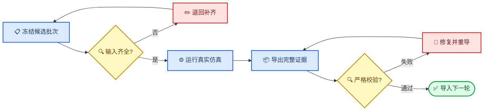

# 真实仿真数据交接与复仿真操作手册

_适用对象：负责 GOA/8T1C 真实 EDA 仿真的同学 · 最后核对：2026-07-14 · 证据范围：simulation only_

---

## 📋 一页行动摘要

### 现在到底缺什么

当前缺口不是“硬盘里没有 CSV”，而是缺少一批能够同时回答下面四个问题的有效数据：

1. 这是哪个候选参数点？
2. 仿真器实际使用了什么网表、模型、激励和工况？
3. 原始波形和计算后的指标在哪里？
4. 日志、文件哈希和元数据能否证明结果可复核、没有串行或重复？

算法已经能生成下一轮候选，也能导入真实仿真结果。现在最需要仿真同学完成的是：**严格按候选批次运行真实 EDA 仿真，并把参数、波形、指标、日志和来源证据一一对应地交回来。**

### 收到什么、做什么、交什么

| 阶段 | 仿真同学收到 | 仿真同学完成 | 验收后输出 |
| --- | --- | --- | --- |
| 输入冻结 | `simulation_batch.csv`、基准网表、规格和节点映射 | 检查工具、模型、单位和工况是否齐全 | 输入确认记录 |
| 真实运行 | 一个基准和若干候选 | 逐个运行，不改 ID 和参数 | 成功 run 的波形；全部 run 的状态/日志；网表或受控引用 |
| 结果整理 | 仿真原始输出 | 导出 UTF-8 波形 CSV，保留失败状态 | `run_status.csv`、可导入的 `simulation_results.csv` 和 run 目录 |
| 联合验收 | 完整交付包 | 与算法同学核对候选、列、哈希和节点覆盖 | 可导入的 case pack |

### 第一批任务

第一批只做格式闭环，共 **5 个独立参数点**。下表中的 4 个候选来自当前本地 shortlist `outputs/cgg_v1_llso_from_docx/pia_suggest_round2/pia_selected_candidates.csv`，在算法侧把它们连同基准正式冻结到随批 `simulation_batch.csv` 之前，不得直接开跑：

| `candidate_id` | 角色 | 说明 |
| --- | --- | --- |
| `nominal_baseline` | 基准 | 当前冻结的名义设计 |
| `increase_pullup_10` | 候选 | 上拉能力调整 |
| `increase_pullup_20` | 候选 | 更大幅度上拉能力调整 |
| `reduce_cload_10` | 候选 | 负载电容调整 |
| `faster_clk_edges_10` | 候选 | 时钟边沿调整 |

> 📌 **权威输入：** 最终以算法侧交付的 `simulation_batch.csv` 为准。如果该文件中的 ID 或参数与上表不同，先停止并让算法侧确认，仿真侧不要自行改名或修数。

### 三条不可改写的边界

所有待仿真的 PIA 候选、case-pack 声明、下一轮建议和相关报告必须逐字保留：

```text
data_source = real_simulation_csv
engineering_validity = simulation_only
must_resimulate = true
```

- `data_source = real_simulation_csv`：数据来自真实电路仿真导出的 CSV，不代表实物测量。
- `engineering_validity = simulation_only`：结论只在当前仿真模型、网表和工况内有效。
- `must_resimulate = true`：算法产生的候选必须重新仿真，不能把预测值当作已验证结果。

当前导入器会把成功导入的已完成结果行标为 `must_resimulate = false`；但 case-pack 的场景边界和下一轮新候选仍必须保持 `must_resimulate = true`。无论候选还是已导入结果，`engineering_validity` 始终是 `simulation_only`。

### 总流程



## 🎯 什么才算有效的真实仿真数据

### 必须同时满足的条件

一条训练或验证样本只有同时满足以下条件，才可进入真实仿真数据集：

- 使用实际电路网表和真实仿真器执行，不是本地测试函数生成
- `candidate_id` 能与 `simulation_batch.csv` 中的唯一候选对应
- 使用的参数值与候选批次一致，没有仿真侧静默改写
- 保留可读取的时间域波形，而不是只保留截图或一个总分
- 保留仿真器、版本、模型、工况、命令或运行设置、退出状态和日志
- 文件可解析、节点覆盖满足本次声明、单位明确
- 与其他样本的内容哈希不同；重复文件不重复计数
- 结果仍明确属于 `engineering_validity = simulation_only`

### 不能算作新真实仿真证据的内容

| 内容 | 可以做什么 | 为什么不能计为新真实仿真 |
| --- | --- | --- |
| `local_fixture` | 测试代码和闭环流程 | 它是确定性测试夹具，不是物理仿真器 |
| 论文图数字化 | 提供弱标签和复仿真线索 | 曲线来自公开材料，不是本项目自行运行 |
| public demo / sample case | 演示界面和格式 | 不能证明本批候选被真实运行 |
| 重复波形文件 | 排查流程或复现 | 相同 SHA-256 只能算一个独立证据 |
| 只有部分可见节点 | 局部分析 | 不能声称覆盖完整 720 级 |
| 二进制 `.tr0` 单独交付 | 原始归档 | 当前读取链路不能直接把它当作波形 CSV |
| 截图、表格照片 | 人工快速查看 | 缺少可计算的逐点数值和时间轴 |
| 算法预测分数 | 排候选优先级 | 候选尚未重新仿真 |

原始 `.tr0`、`.raw` 或商业工具数据库可以作为附加归档保留，但必须额外导出可读取的 `waveform.csv`，不能只交二进制文件。

## 👥 双方职责和开跑条件

### 算法侧必须先提供

| 输入 | 最低要求 | 缺失时如何处理 |
| --- | --- | --- |
| `simulation_batch.csv` | 唯一 `candidate_id`、冻结参数、单位或单位说明 | 不开跑 |
| 基准网表或模板 | 能定位参数替换位置和电路版本 | 不开跑 |
| 参数语义 | 上拉、下拉、复位、自举、电容、时钟和电源角色 | 不猜映射 |
| 节点映射 | 输入、时钟、关键内部节点、`o1...oN` 输出 | 不自行臆测 |
| 规格配置 | 阈值、目标脉宽、保持时间、级数 | 不自行改阈值 |
| 工况表 | 模型角、温度、供电、负载和随机种子 | 缺哪个暂停哪个工况 |
| 交付位置 | 批次目录、命名规则、私有文件传输渠道 | 不把私有文件提交到 Git |

### 仿真侧负责

1. 对输入做预检查，发现缺项先退回，不凭经验补数字。
2. 每个 `candidate_id` 建立独立 run，使用批次中冻结的参数。
3. 运行真实仿真器并保留成功、失败、超时和不收敛记录。
4. 导出可解析波形、运行元数据、网表副本或网表哈希、日志和指标。
5. 对每个文件计算 SHA-256，识别重复或误复制。
6. 按本手册整理批次级 `simulation_results.csv` 和 case pack。
7. 与算法侧完成格式试跑验收后，再开始大批量运行。

### 禁止静默处理

以下情况必须暂停并联系算法侧：

- 候选参数超出模型或工具允许范围
- 参数单位不明或同一列混用不同单位
- 器件编号无法确定对应 pullup、pulldown、reset 或 bootstrap
- 模型角、温度、电压、负载缺少明确取值
- 节点名称与映射表不一致
- 为了收敛必须修改网表、激励、步长上限或初始条件
- 真实工具不可用，只能使用 mock 或 fixture

如经双方确认必须修改，需生成新的设计版本或候选批次，不能覆盖原 `candidate_id`。

### GOA 关键参数角色

仿真侧应按电路功能角色核对参数，不能看到 `T1`、`T2` 或一个通用 `transistor_width` 就直接猜映射。

| 功能角色 | 传统 TFT 字段 | 晶体管级字段 | 说明 |
| --- | --- | --- | --- |
| 上拉 | `TFT_pullup_W/L` | `M_pullup_W/L` | 驱动输出高电平 |
| 下拉 | `TFT_pulldown_W/L` | `M_pulldown_W/L` | 负责输出放电 |
| 复位 | `TFT_reset_W/L` | `M_reset_W/L` | 受复位信号控制 |
| 自举 | `TFT_bootstrap_W/L` | `M_bootstrap_W/L` | 自举或充电支路 |
| 电容 | `C_boot`、`C_load` | 同名 | 必须记录实际单位 |
| 时钟 | `CLK_amp`、`CLK_rise_time`、`CLK_fall_time` | `CLK_rise_time`、`CLK_fall_time` | 来自实际激励设置 |
| 电源/漂移 | `VGH`、`VGL`、`Vth_shift` | `VDD`、`VSS`、`VGH`、`VGL`、`Vth_shift` | 与工况和模型共同记录 |

不同拓扑中同一器件编号可能承担不同角色。算法侧应按 `topology_id` 提供映射；无法确认时留作阻塞项，不要自动填充。

## 🔄 分阶段补数方案

### 阶段 A：5 点格式试跑

目标是验证“候选 → 网表 → 仿真 → 波形 → 结果 → 导入”完整链路，不以算法优劣为结论。

- 运行 `nominal_baseline` 和当前 4 个候选
- 全部使用同一名义模型、温度、供电和负载
- 每个 run 都交完整目录，包括失败 run
- 算法侧验证波形可读、ID 对齐、参数一致和边界字段
- 5 个点全部通过格式验收后，才进入阶段 B

### 阶段 B：至少 30 个独立参数点

阶段 B 扩展到 **总计至少 30 个内容不重复的参数点**。建议由算法侧按候选角色冻结成三组，每组 10 个：

| 组别 | 数量 | 目的 |
| --- | ---: | --- |
| exploitation | 10 | 在已知较优区域附近细化 |
| boundary learning | 10 | 主动覆盖约束边界和轻微失败区 |
| diversity exploration | 10 | 扩大参数空间覆盖，降低样本同质化 |

这里的组别是候选选择角色，不是预先设定的“通过/失败”标签。实际仿真结果必须原样保留，不能为了平衡数据手工改分，也不能只交成功点。

### 阶段 C：基准与前三名候选的工况筛查

阶段 C 对阶段 B 中经过真实结果确认的前三名候选和名义基准进行 one-factor-at-a-time 筛查。每个设计执行 9 个工况，共 36 个 run：

| 工况类别 | 取值 | 说明 |
| --- | --- | --- |
| 名义 | 1 个 | typical、名义温度/供电/负载 |
| 模型角 | slow、fast | 其他条件保持名义 |
| 温度 | 最低、最高 | 其他条件保持名义 |
| 供电 | 最低、最高 | 其他条件保持名义 |
| 负载 | 最低、最高 | 其他条件保持名义 |

所有数值必须来自电路负责人冻结的工况配置。没有项目值时暂停该工况，不能在文档或仿真端自行编造。

当前导入 schema 只把 `candidate_id` 作为候选主键，并默认拒绝同一个结果文件内的重复 ID。因此阶段 C 必须建立 **9 个独立工况批次和 9 个 case pack**：每个工况批次包含基准和 3 个候选，共 4 行，包内 `candidate_id` 唯一；`condition_id` 写入批次清单、run ID 和元数据。同一候选可以出现在不同工况批次，但不得把 9 个工况合并进一个 `simulation_results.csv`。

### 阶段 D：正式对比或论文矩阵

仅当阶段 C 通过、且数据要用于正式对比或论文时执行。对名义基准和最佳候选做完整矩阵：

```text
2 个设计 × 3 个模型角 × 3 个温度 × 3 个供电 × 3 个负载 = 162 个 run
```

阶段 D 同理建立 **81 个独立工况批次和 81 个 case pack**，每个批次只包含基准和最佳候选两行。除非未来代码明确把导入主键扩展为 `(candidate_id, condition_id)`，否则不得把 81 个工况合并到一个结果文件。

如果模型库不支持某类角，必须在 `provenance.json` 中写明 `not_available` 和原因，不能用其他角冒充。

## 📦 每个 run 的交付目录

### 最低目录结构

```text
batch_YYYYMMDD_HHMM/
├─ batch_manifest.yaml
├─ simulation_batch.csv
├─ run_status.csv
├─ simulation_results.csv
├─ checksums.sha256
├─ runs/
│  └─ <candidate_id>__<condition_id>/
│     ├─ waveform.csv                 # 成功 run 必交；失败 run 有输出则交
│     ├─ params.yaml
│     ├─ simulation_metadata.json
│     ├─ source_netlist.spice         # 仅允许共享时
│     ├─ source_netlist.ref.json      # 受限时用哈希和受控存储引用替代
│     ├─ simulator_stdout.txt
│     ├─ simulator_stderr.txt
│     ├─ simulator_exit_status.json
│     ├─ op_metrics.csv              # 可选
│     ├─ ac_metrics.csv              # 可选
│     ├─ dc_metrics.csv              # 可选
│     ├─ tran_metrics.csv            # 可选
│     └─ raw/                        # 可选，走私有大文件渠道
└─ case_pack/
   └─ <scenario_id>/
      ├─ scenario.yaml
      ├─ history.csv
      ├─ candidate_pool.csv
      ├─ simulation_results.csv
      ├─ scoring_config.yaml
      └─ provenance.json
```

上面是一份“单工况批次”的结构。阶段 C/D 应在外层再按 `conditions/<condition_id>/` 分开保存，每个工况目录各自包含 `simulation_batch.csv`、`run_status.csv`、`simulation_results.csv`、`runs/` 和独立 case pack。

### `params.yaml`

该文件记录本次实际使用的参数和工况，不能只复制候选表而不核对真实网表。

```yaml
run_id: increase_pullup_10__nominal
candidate_id: increase_pullup_10
circuit_version: goa_8t1c_frozen_v1
topology_id: GOA_8T1C
parameters:
  TFT_pullup_W: 4400
  TFT_pullup_L: 3.5
  C_boot: 4.0
  C_load: 252.0
parameter_units:
  TFT_pullup_W: um
  TFT_pullup_L: um
  C_boot: pF
  C_load: pF
conditions:
  model_corner: typical
  temperature_c: 25
  supply_profile: nominal
  load_profile: nominal
```

示例数值只展示文件形状；正式值必须逐项复制自冻结批次和工况表。

### `simulation_metadata.json`

```json
{
  "run_id": "increase_pullup_10__nominal",
  "candidate_id": "increase_pullup_10",
  "simulator": "actual_tool_name",
  "simulator_version": "actual_version",
  "execution_mode": "real_simulator",
  "model_set": "frozen_model_identifier",
  "netlist_sha256": "<sha256>",
  "started_at": "2026-07-14T10:00:00+08:00",
  "completed_at": "2026-07-14T10:05:00+08:00",
  "exit_code": 0,
  "converged": true,
  "time_step_s": 1e-9,
  "max_step_s": 1e-9,
  "stop_time_s": 1e-3,
  "saved_nodes": ["clk", "o1", "o2", "o720"],
  "node_coverage": "partial_visible_nodes",
  "data_source": "real_simulation_csv",
  "engineering_validity": "simulation_only"
}
```

### 日志与失败 run

- `simulator_stdout.txt`：标准输出或工具导出的运行日志
- `simulator_stderr.txt`：错误输出；没有内容也保留空文件
- `simulator_exit_status.json`：退出码、是否收敛、错误类别、失败阶段和重试次数
- `source_netlist.spice`：允许分享时交副本；不允许分享时交哈希、受控存储位置和电路版本

失败 run 不能删除。所有运行先进入批次级 `run_status.csv`，至少保留 `candidate_id`、`condition_id`、`sim_success = false`、失败原因和日志路径。失败 run 没有生成有效波形时，可以没有 `waveform.csv`，但状态、日志和实际参数仍必须存在。

`simulation_results.csv` 只保存已经具备合法 `overall_score` 和 `hard_constraint_passed`、可进入导入 schema 的结果。若失败 run 无法计算分数，先只放在 `run_status.csv`；如冻结的统一评分规则明确把某类失败映射为数值分数，应由算法侧生成后再加入可导入结果，仿真侧不能随手填 `0.0`。

## 📊 波形与结果字段规范

### `waveform.csv`

仓库当前读取器支持逗号分隔或空白分隔文本表格，并执行以下归一化：

- 时间列必须命名为 `TIME` 或 `XVAL`，大小写不敏感
- `v(o1)` 会归一化为 `o1`
- 其他列名会转为小写
- 时间和信号必须能转换为数值
- 行会按时间升序排列

推荐直接交 UTF-8、逗号分隔 CSV：

```csv
TIME,v(clk),v(o1),v(o2),v(o3),v(o720)
0.000000000,0.0,0.0,0.0,0.0,0.0
0.000000001,15.0,0.1,0.0,0.0,0.0
0.000000002,15.0,6.2,0.2,0.0,0.0
```

时间列在系统内部按秒解释。电压按伏特解释。若工具导出的单位不是秒或伏特，必须在导出时换算，或在元数据中明确记录换算方法并让算法侧确认。

### 时间长度与采样要求

- 覆盖电路启动阶段
- 覆盖至少两个完整扫描周期，用于区分重复合法脉冲和误触发
- 覆盖规格要求的保持窗口
- 若要评价低频保持，仿真时长必须达到对应刷新周期；否则只能标记不可评价
- 采样步长足以解析时钟和输出的上升沿、下降沿及脉宽
- 在 `simulation_metadata.json` 记录实际步长、最大步长、停止时间和保存节点

### 720 级覆盖声明

- 声称“完整 720 级”时，最终交给当前读取器的 `waveform.csv` 必须实际包含归一化列 `o1` 至 `o720`
- 工具原始节点名不一致时，必须先执行明确的转换步骤生成规范化 CSV；旁置 `net_mapping.yaml` 只用于追踪，当前读取器不会自动使用它改列名
- 只保存头部、中部和尾部节点时，必须标记为 `partial_visible_nodes`
- 部分节点数据可以做局部诊断，但不能用于“所有级通过”“完整级联稳定”等结论
- 节点缺失不能用插值、复制相邻级或重命名其他节点补齐

### `simulation_results.csv`

最小可导入结果：

```csv
candidate_id,overall_score,hard_constraint_passed,sim_success,failure_reason
nominal_baseline,78.4,true,true,
increase_pullup_10,82.1,true,true,
```

字段规则：

| 字段 | 要求 | 常见错误 |
| --- | --- | --- |
| `candidate_id` | 必填、唯一、必须存在于批次 | 改名、重复、串候选 |
| `overall_score` | 必填、数值型 | 填预测分、填字符串 |
| `hard_constraint_passed` | 必填、布尔型 | 用含糊文本替代 |
| 参数列 | 可省略；若提供必须与批次相同 | 仿真侧改参数但沿用旧 ID |
| 额外指标 | 可以保留 | 无单位、列名不稳定 |

若仿真侧只负责原始运行、不负责 CircuitPilot 评分，则先交成功波形和包含全部 run 的 `run_status.csv`，由算法侧统一生成 `overall_score` 和 `hard_constraint_passed`。不要人工主观打分，也不要为无有效波形的失败 run 随手补零分。

### 晶体管级补充指标

使用 `config/pia_ca_llso_transistor_profile.yaml` 时，每个成功结果还应包含：

| 字段 | 单位 | 含义 |
| --- | --- | --- |
| `delay_s` | s | 延迟 |
| `rise_time_s` | s | 上升时间 |
| `fall_time_s` | s | 下降时间 |
| `power_w` | W | 功耗 |
| `voh_min_v` | V | 最低输出高电平 |

这些列属于当前晶体管级执行配置要求。不能从波形可靠计算的指标应标记为不可评价，并记录原因，不能填零冒充实测值。

## 🗂️ 正式 case pack 六件套

### 六个文件的职责

| 文件 | 作用 | 关键要求 |
| --- | --- | --- |
| `scenario.yaml` | 场景、路径、方法和边界 | 引用其他五个文件 |
| `history.csv` | 已完成的历史仿真 | 有参数、分数和硬约束 |
| `candidate_pool.csv` | 仿真前候选 | 不得含真实结果或波形指标 |
| `simulation_results.csv` | 候选的导入结果 | ID 对齐、无重复、数值合法 |
| `scoring_config.yaml` | 目标和评价口径 | 与本批规格一致 |
| `provenance.json` | 来源、工具、哈希和限制 | 可审计、边界完整 |

### `scenario.yaml` 示例

```yaml
scenario_id: real_goa_batch_001
history_csv: history.csv
candidate_csv: candidate_pool.csv
result_csv: simulation_results.csv
scoring_config: scoring_config.yaml
provenance: provenance.json
methods:
  - pia_full
seeds:
  - 1
top_k: 4
target_score: 80
evidence_boundary:
  data_source: real_simulation_csv
  engineering_validity: simulation_only
  must_resimulate: true
```

### 防止结果泄漏

`candidate_pool.csv` 是仿真前输入，不得包含：

- `overall_score`
- `hard_constraint_passed`
- delay、rise/fall time、power、VOH 等真实仿真指标
- 从结果波形计算出的约束字段

这些字段只能出现在 `history.csv` 或 `simulation_results.csv`。否则算法可能在选候选时提前看到答案，正式验证将失效。

## 🔌 华大九天 Empyrean FPD 导出示例

### 推荐导出结构

```text
empyrean_case/
├─ simulation/
│  └─ waveform.csv
├─ verification/
│  ├─ drc_report.txt
│  ├─ lvs_report.txt
│  └─ erc_report.txt
├─ rc/
│  └─ rc_result.csv
├─ model/
│  ├─ model.sp                  # 仅允许共享时
│  └─ model.ref.json            # 受限时用模型 ID、哈希和受控引用替代
├─ schematic/
│  ├─ netlist.sp                # 仅允许共享时
│  └─ netlist.ref.json          # 受限时用版本、哈希和受控引用替代
├─ layout/
│  └─ layer_summary.json
├─ net_mapping.yaml
└─ params.yaml
```

### 工具侧动作

1. 从 ALPSFPD 或 iWaveFPD 导出时间域波形 CSV。
2. 确认时间列能映射到 `TIME`/`XVAL`，并转换生成实际使用 `o1...oN` 规范列名的波形 CSV；`net_mapping.yaml` 本身不会触发自动改名。
3. 从原理图或网表导出实际使用的器件和参数。
4. 如本轮涉及版图后仿，附 ArgusFPD 的 DRC/LVS/ERC 报告和 RCExplorerFPD 的 RC 结果。
5. 在 `net_mapping.yaml` 中记录原理图、波形、版图和 RC 名称的对应关系。
6. 将工具版本、模型版本、工况、执行状态和哈希写入元数据。

### 工具来源与 PIA 边界分开记录

Empyrean 离线导入适配器会记录工具来源，例如 `toolchain = empyrean_fpd_offline`、`execution_mode = offline_import_only`。这类字段说明“文件从哪里来、当前适配器是否直接调用工具”。

PIA case pack 仍必须保留统一的结果边界：

```text
data_source = real_simulation_csv
engineering_validity = simulation_only
must_resimulate = true
```

不要为了匹配 PIA schema 删除真实工具名、模型版本或报告来源；也不要用工具来源字段替换 PIA 的边界字段。两组信息应同时存在。

> 🔐 **私有数据：** PDK、商业模型、许可证、完整 GDS 和受限原始数据库通过团队批准的私有渠道传输，不提交到 Git。仓库中只放允许共享的小型文本证据、哈希、清单和文档。

## 🚫 拒收条件和常见返工

出现以下任一情况，本批数据不得计入正式真实仿真样本：

| 拒收项 | 检查方法 | 返工动作 |
| --- | --- | --- |
| 重复波形 | 比较 SHA-256 | 查明复制来源并重新运行 |
| 单位缺失或混用 | 对照参数/元数据 | 补单位并重新导出 |
| 节点不完整 | 对照节点映射和 stage count | 补导节点或降级为局部证据 |
| `candidate_id` 错位 | 与批次做集合比较 | 按原批次重建结果 |
| 候选参数被改写 | 逐列比较参数 | 新建候选 ID 后重跑 |
| 只交截图或总分 | 查 run 目录 | 补交逐点波形和元数据 |
| 论文曲线冒充仿真 | 检查 provenance | 标为 `paper_digitized` 弱证据 |
| mock 冒充真实工具 | 检查执行模式和日志 | 使用真实仿真器重跑 |
| 日志或退出状态缺失 | 查固定文件 | 补导日志和状态 |
| 私有文件进入 Git | 检查待提交内容 | 撤出仓库并改走私有渠道 |

其他需要返工的典型情况：

- CSV 第一行没有表头
- 时间列名为工具私有名称且没有映射
- 数值使用千位逗号，导致 CSV 列错位
- `candidate_id` 前后有空格或大小写变化
- 同一 run 的波形、参数和网表来自不同仿真轮次
- 失败 run 被删除，导致数据只剩成功样本
- 720 级只导出少数节点，却在报告里写“全级通过”
- 不收敛后修改参数，但仍沿用原候选 ID

## ✅ 交付、验收与问题回退

### 仿真同学交付前清单

- [ ] 已收到冻结的 `simulation_batch.csv`
- [ ] 每个 `candidate_id` 唯一且未改名
- [ ] 每个 run 的实际参数与批次完全一致
- [ ] 参数、时间、电压、电容和温度单位明确
- [ ] 使用真实仿真器，工具名和版本已记录
- [ ] 每个成功 run 都有 `waveform.csv`；失败 run 无有效波形时已保留状态和日志
- [ ] 时间列为 `TIME` 或 `XVAL`
- [ ] 节点覆盖与声明一致
- [ ] 仿真长度覆盖启动、两个扫描周期和要求的保持窗口
- [ ] 成功、失败、不收敛和超时 run 均保留
- [ ] 每个 run 都有日志和退出状态
- [ ] 所有文件已计算 SHA-256，重复文件已标记
- [ ] `simulation_results.csv` 的结果 ID 全部属于当前批次
- [ ] 没有人工填写预测分或主观分数
- [ ] case pack 六件套齐全
- [ ] 三条证据边界逐字保留
- [ ] 私有 PDK、模型和许可证未进入 Git

### 算法侧收到后的验收

1. 解压到临时目录，先核对批次 ID、run 数和哈希。
2. 用当前波形读取器读取所有 `waveform.csv`，检查时间列、数值列和必需节点。
3. 检查 `simulation_results.csv` 是否有重复、未知或缺失的 `candidate_id`。
4. 检查 `overall_score` 为数值、`hard_constraint_passed` 为布尔值。
5. 若结果中包含参数列，逐列与 `simulation_batch.csv` 比较。
6. 检查 candidate pool 不含结果列，防止数据泄漏。
7. 运行严格 case-pack 校验；随后通过正常导入/恢复流程调用结果 schema 校验，只有两层都通过后才导入历史并进入下一轮。

Windows PowerShell 验证命令：

```powershell
$env:PYTHONPATH = 'src'
python -m goa_eval.cli pia-validate `
  --case-pack-root '<交付包>/case_pack' `
  --output-dir "$env:TEMP/pia_case_pack_validation" `
  --strict-evidence
```

`pia-validate --strict-evidence` 负责检查 case-pack 结构、证据边界、结果列存在性和候选/结果集合关系，但它不能替代导入 schema 的全部检查。算法侧仍必须独立完成：重复 `candidate_id` 检查、每个 `overall_score` 的数值检查、`hard_constraint_passed` 的显式布尔检查，以及结果参数与 `simulation_batch.csv` 的逐列一致性检查。

成功标准：严格 case-pack 命令退出码为 0，且随后正常导入/恢复流程没有重复 ID、未知 ID、非法分数、非法布尔值、参数改写、结果泄漏或边界错误。

### 问题回退原则

| 问题类型 | 是否保留原 run | 下一步 |
| --- | --- | --- |
| 文件命名/格式错误 | 保留 | 修复导出，不重跑电路 |
| 节点漏导 | 保留 | 能从原始数据库补导则补导，否则重跑 |
| 参数与 ID 不一致 | 保留为无效证据 | 新建正确批次并重跑 |
| 仿真失败或不收敛 | 保留为失败样本 | 记录原因，不覆盖原参数 |
| 工况缺失 | 保留已完成工况 | 补齐配置后只跑缺失项 |
| 重复波形 | 保留一份 | 排查是否误复制，缺少的独立点重跑 |
| 工具/模型版本变化 | 分批保留 | 新建批次，不与旧批次静默混合 |

### 完成定义

本轮任务只有在以下条件同时满足时才完成：

- 阶段 A 的 5 个点全部通过格式和导入验收
- 阶段 B 至少有 30 个哈希不同、参数不同、ID 可追踪的真实仿真点
- 每个点均可从候选追溯到网表、工况、波形、日志和结果
- 失败样本没有被删掉或伪装成成功样本
- 声称完整 720 级的 run 确实具有完整节点覆盖
- 严格 case-pack 校验通过
- 所有结论继续限定为 `engineering_validity = simulation_only`
- 下一轮新候选继续保持 `must_resimulate = true`

### 仓库内参考

- [指标定义](metrics_spec.md)
- [公开输出 schema](schema_spec.md)
- [PIA 仿真器适配协议](pia_ca_llso_simulator_adapter.md)
- [PIA 真实仿真 case pack](pia_ca_llso_real_case_pack.md)
- [PIA 证据 case pack](pia_ca_llso_evidence_case_pack.md)
- [Empyrean FPD 离线导入适配器](empyrean_offline_adapter.md)
- [PIA Phase 2 真实仿真闭环计划](plans/2026-06-27-pia-ca-llso-phase-2-real-simulation-closed-loop.md)

---

_维护原则：仿真参数、工况范围和模型版本以每次冻结批次为准；本手册只定义交付、追踪和验收契约，不替电路负责人编造缺失设置。_
